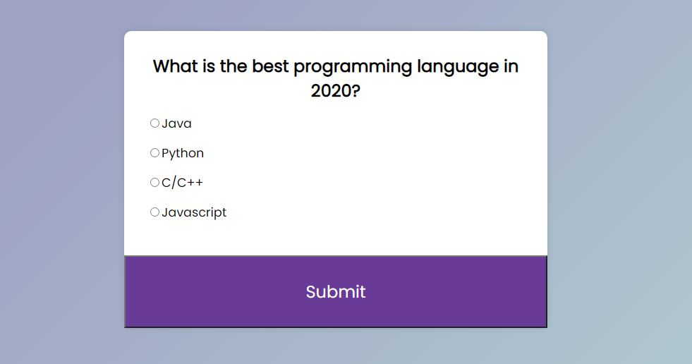
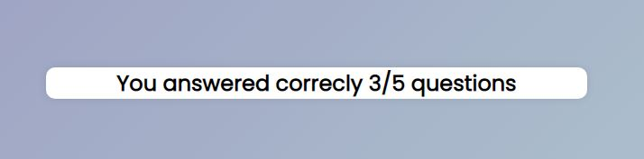

# Quiz-App
Quiz-App contains 3 files: 
1. index.html
2. style.css
3. script.js

index.html -> Here we link to external resources style.css and script.js, Then adds a quiz container and defines Question Text and Options list

style.css -> Here we add background color and styling the text and alignments

script.js -> Here we have 3 functions(loadQuiz(), getSelected(), deselectAnswers())

loadQuiz() -> This function responsible for displaying questions and its options

deselectAnswers() -> This function deselect check(***tick***) option by default

getSelected() -> User clicked Id is captured, Then it is sent for addEventListener

Submit -> onclick of submit button, scores be recorded. At the end of quiz, total score be displayed in a new page.

***MCQ QuizApp***

***MCQ Result***

